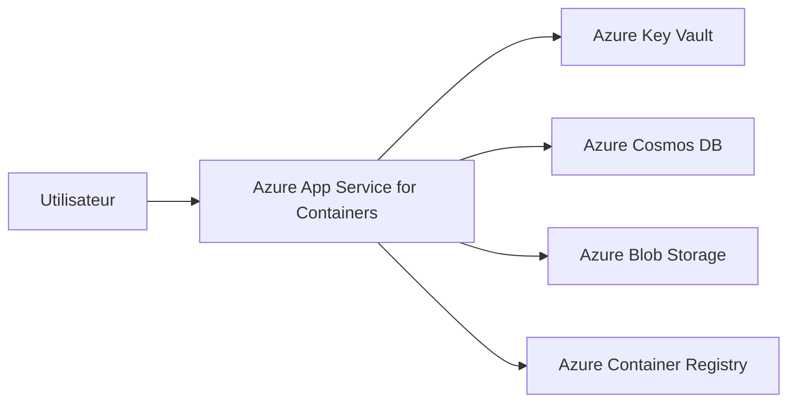

# Azure TODO App

Application web TODO simple, conteneurisee et preparee pour un deploiement sur Azure avec :

- Azure App Service for Containers
- Azure Container Registry
- Azure Cosmos DB
- Azure Key Vault
- Managed Identity
- Azure Blob Storage
- Deployment slot `staging`
- Mise a l'echelle manuelle

## Choix technologique

- Backend : `Node.js 22` + `Express`
- Frontend : `EJS` + CSS simple
- Base de donnees : `Azure Cosmos DB for NoSQL`
- Gestion des secrets : `Azure Key Vault` via `DefaultAzureCredential`
- Stockage objet : `Azure Blob Storage`
- Conteneurisation : `Docker`

Pourquoi ce choix :

- stack legere et rapide a presenter ;
- SDK Azure officiels faciles a expliquer ;
- deploiement simple sur App Service for Containers ;
- mode local possible sans Azure pour demarrer vite.

## Fonctionnalites

- ajouter une tache ;
- afficher les taches ;
- changer l'etat d'une tache ;
- supprimer une tache ;
- exporter les taches en JSON vers Azure Blob Storage ;
- lister les exports blobs dans l'interface.

## Architecture simple



## Ressources Azure utilisees

- 1 Resource Group
- 1 Azure Container Registry
- 1 App Service Plan Linux
- 1 Web App for Containers
- 1 deployment slot `staging`
- 1 Azure Cosmos DB account
- 1 Cosmos DB database
- 1 Cosmos DB container
- 1 Key Vault
- 1 Storage Account
- 1 Blob container

### Ressources creees pour la demonstration

- Resource Group : `rg-todo-demo-2604101022`
- Azure Container Registry : `acrtododemo2604101022`
- App Service Plan Linux : `plan-todo-demo-2604101022-a`
- Web App for Containers : `apptododemo2604101022`
- Deployment slot : `staging`
- Azure Cosmos DB account : `cosmostododemo2604101022`
- Cosmos DB database : `todo-app-db`
- Cosmos DB container : `tasks`
- Key Vault : `kvtododemo2604101022`
- Secret : `cosmos-key`
- Storage Account : `stododemo2604101022`
- Blob container : `exports`

## Variables d'environnement

Copier `.env.example` vers `.env` pour le local.

Variables principales :

- `USE_FILE_STORAGE=true` : mode local sans Azure
- `COSMOS_ENDPOINT` : endpoint Cosmos DB
- `COSMOS_KEY` : cle Cosmos DB si pas de Key Vault
- `COSMOS_DATABASE` : base `todo-app-db`
- `COSMOS_CONTAINER` : conteneur `tasks`
- `COSMOS_PARTITION_KEY=/id`
- `KEY_VAULT_URL` : URL du coffre
- `COSMOS_KEY_SECRET_NAME` : nom du secret contenant la cle Cosmos
- `AZURE_STORAGE_CONNECTION_STRING` : connexion Blob Storage
- `BLOB_CONTAINER_NAME=exports`

## Lancement local

### 1. Installer

```powershell
npm install
```

### 2. Demarrer en mode local simple

Dans `.env` :

```env
USE_FILE_STORAGE=true
PORT=3000
```

Puis :

```powershell
npm start
```

Application accessible sur `http://localhost:3000`

Les taches sont alors stockees dans `data/tasks.json`.

## Docker

### Build local

```powershell
docker build -t azure-todo-app:v1 .
```

### Execution locale

```powershell
docker run --rm -p 3000:8080 --env-file .env azure-todo-app:v1
```

Application accessible sur `http://localhost:3000`

## Utilisation de Cosmos DB

L'application utilise Cosmos DB pour persister les taches en production.

- database : `todo-app-db`
- container : `tasks`
- partition key : `/id`

Si `USE_FILE_STORAGE=false`, l'application cree automatiquement la database et le container s'ils n'existent pas.

## Utilisation de Key Vault et Managed Identity

Le secret utile a stocker dans Key Vault est la cle `Cosmos DB`.

Fonctionnement :

1. l'App Service recoit une Managed Identity system-assigned ;
2. cette identite obtient le role lui permettant de lire les secrets du Key Vault ;
3. l'application utilise `DefaultAzureCredential` ;
4. au demarrage, elle lit le secret `COSMOS_KEY_SECRET_NAME` depuis `KEY_VAULT_URL` ;
5. la cle recuperee sert a se connecter a Cosmos DB.

Cela permet d'eviter de stocker la cle Cosmos directement dans le code ou dans un fichier.

## Utilisation de Blob Storage

Un bouton de l'application permet d'exporter les taches en JSON dans un blob container.

Demonstration possible :

- creation d'un export JSON ;
- visualisation de la liste des blobs ;
- ouverture d'une URL de blob si le conteneur est public ;
- preuve d'une operation de stockage objet.

## Deployment Slot

Le slot `staging` permet de :

- tester une nouvelle version sans impacter la production ;
- valider la configuration ;
- faire un swap ensuite si besoin.

## Scaling manuel

La mise a l'echelle manuelle sur le plan App Service permet :

- d'augmenter le nombre d'instances pour absorber plus de trafic ;
- de montrer un premier levier d'exploitation cloud ;
- puis de revenir a une configuration economique apres demonstration.

## Principales commandes Azure CLI

Exemple complet a adapter :

```powershell
$RESOURCE_GROUP="rg-todo-demo-2604101022"
$LOCATION="switzerlandnorth"
$PLAN_LOCATION="swedencentral"
$ACR_NAME="acrtododemo2604101022"
$PLAN_NAME="plan-todo-demo-2604101022-a"
$WEBAPP_NAME="apptododemo2604101022"
$COSMOS_NAME="cosmostododemo2604101022"
$KEYVAULT_NAME="kvtododemo2604101022"
$STORAGE_NAME="stododemo2604101022"
$IMAGE_NAME="azure-todo-app:v1"
```

### Connexion

```powershell
az login
az account show
```

### Groupe de ressources

```powershell
az group create --name $RESOURCE_GROUP --location $LOCATION
```

### Azure Container Registry

```powershell
az acr create --resource-group $RESOURCE_GROUP --name $ACR_NAME --sku Basic
az acr login --name $ACR_NAME
docker tag azure-todo-app:v1 "$ACR_NAME.azurecr.io/azure-todo-app:v1"
docker push "$ACR_NAME.azurecr.io/azure-todo-app:v1"
```

### Cosmos DB

```powershell
az cosmosdb create --name $COSMOS_NAME --resource-group $RESOURCE_GROUP
az cosmosdb sql database create --account-name $COSMOS_NAME --resource-group $RESOURCE_GROUP --name todo-app-db
az cosmosdb sql container create --account-name $COSMOS_NAME --resource-group $RESOURCE_GROUP --database-name todo-app-db --name tasks --partition-key-path /id
```

### Recuperer endpoint et cle Cosmos

```powershell
az cosmosdb show --name $COSMOS_NAME --resource-group $RESOURCE_GROUP --query documentEndpoint -o tsv
az cosmosdb keys list --name $COSMOS_NAME --resource-group $RESOURCE_GROUP --type keys
```

### Key Vault

```powershell
az keyvault create --name $KEYVAULT_NAME --resource-group $RESOURCE_GROUP --location $LOCATION
az keyvault secret set --vault-name $KEYVAULT_NAME --name cosmos-key --value "<COSMOS_PRIMARY_KEY>"
```

### Storage Account et Blob container

```powershell
az storage account create --name $STORAGE_NAME --resource-group $RESOURCE_GROUP --location $LOCATION --sku Standard_LRS
az storage container create --name exports --account-name $STORAGE_NAME --auth-mode login
az storage account show-connection-string --name $STORAGE_NAME --resource-group $RESOURCE_GROUP -o tsv
```

### App Service Plan et Web App for Containers

```powershell
az appservice plan create --name $PLAN_NAME --resource-group $RESOURCE_GROUP --is-linux --sku S1 --location "Sweden Central"
az webapp create --resource-group $RESOURCE_GROUP --plan $PLAN_NAME --name $WEBAPP_NAME --container-image-name "$ACR_NAME.azurecr.io/azure-todo-app:v1" --container-registry-url "https://$ACR_NAME.azurecr.io"
```

### Autoriser le pull depuis ACR

```powershell
az webapp identity assign --resource-group $RESOURCE_GROUP --name $WEBAPP_NAME
$PRINCIPAL_ID=$(az webapp identity assign --resource-group $RESOURCE_GROUP --name $WEBAPP_NAME --query principalId -o tsv)
$ACR_ID=$(az acr show --name $ACR_NAME --resource-group $RESOURCE_GROUP --query id -o tsv)
az role assignment create --assignee-object-id $PRINCIPAL_ID --assignee-principal-type ServicePrincipal --scope $ACR_ID --role AcrPull
```

### Donner acces au Key Vault

```powershell
$KV_ID=$(az keyvault show --name $KEYVAULT_NAME --resource-group $RESOURCE_GROUP --query id -o tsv)
az role assignment create --assignee-object-id $PRINCIPAL_ID --assignee-principal-type ServicePrincipal --scope $KV_ID --role "Key Vault Secrets User"
```

### Configurer l'application

```powershell
$COSMOS_ENDPOINT=$(az cosmosdb show --name $COSMOS_NAME --resource-group $RESOURCE_GROUP --query documentEndpoint -o tsv)
$STORAGE_CONNECTION=$(az storage account show-connection-string --name $STORAGE_NAME --resource-group $RESOURCE_GROUP --query connectionString -o tsv)
$KEYVAULT_URL="https://$KEYVAULT_NAME.vault.azure.net/"

az webapp config appsettings set --resource-group $RESOURCE_GROUP --name $WEBAPP_NAME --settings `
  PORT=8080 `
  NODE_ENV=production `
  USE_FILE_STORAGE=false `
  COSMOS_ENDPOINT=$COSMOS_ENDPOINT `
  COSMOS_DATABASE=todo-app-db `
  COSMOS_CONTAINER=tasks `
  COSMOS_PARTITION_KEY=/id `
  KEY_VAULT_URL=$KEYVAULT_URL `
  COSMOS_KEY_SECRET_NAME=cosmos-key `
  AZURE_STORAGE_CONNECTION_STRING="$STORAGE_CONNECTION" `
  BLOB_CONTAINER_NAME=exports
```

### Configurer ACR sur la Web App

```powershell
az acr update -n $ACR_NAME --admin-enabled true
$ACR_USER=$(az acr credential show -n $ACR_NAME --query username -o tsv)
$ACR_PASS=$(az acr credential show -n $ACR_NAME --query passwords[0].value -o tsv)

az webapp config container set --name $WEBAPP_NAME --resource-group $RESOURCE_GROUP `
  --container-image-name "$ACR_NAME.azurecr.io/azure-todo-app:v1" `
  --container-registry-url "https://$ACR_NAME.azurecr.io" `
  --container-registry-user $ACR_USER `
  --container-registry-password $ACR_PASS
```

### Deployment slot

```powershell
az webapp deployment slot create --name $WEBAPP_NAME --resource-group $RESOURCE_GROUP --slot staging
az webapp deployment slot list --name $WEBAPP_NAME --resource-group $RESOURCE_GROUP -o table
```

### Scaling manuel

```powershell
az appservice plan update --name $PLAN_NAME --resource-group $RESOURCE_GROUP --number-of-workers 2
az appservice plan update --name $PLAN_NAME --resource-group $RESOURCE_GROUP --number-of-workers 1
```

### URL de l'application

```powershell
az webapp show --resource-group $RESOURCE_GROUP --name $WEBAPP_NAME --query defaultHostName -o tsv
```

## URL de l'application

- production : `https://apptododemo2604101022.azurewebsites.net`
- staging : `https://apptododemo2604101022-staging.azurewebsites.net`

## Ecrans Azure Portal a montrer pendant la demo

- resource group avec toutes les ressources ;
- ACR et image poussee ;
- App Service et URL publique ;
- Cosmos DB Data Explorer avec les taches ;
- Key Vault avec le secret ;
- Managed Identity activee sur la Web App ;
- Storage Account et blob container ;
- deployment slot `staging` ;
- App Service Plan avec changement du nombre d'instances.

## Limites rencontrees / points d'attention

- pour l'environnement local sans Azure, l'application utilise un stockage fichier ;
- l'ouverture directe des URLs de blobs depend de la configuration d'acces du conteneur ;
- le build Docker et le push ACR doivent etre testes sur une machine disposant de Docker ;
- en Azure, il faut attendre quelques secondes apres certaines affectations de roles ;
- le deploiement a ete soumis a une policy de regions autorisees ;
- le plan App Service n'a pas pu etre cree dans `switzerlandnorth` a cause d'un throttling, il a donc ete cree en `swedencentral` ;
- le Key Vault est configure en mode RBAC, il faut donc affecter explicitement les roles pour lire et ecrire les secrets ;
- la premiere reponse HTTP de la Web App peut etre un peu lente juste apres un redemarrage de conteneur.

## Structure du projet

```text
src/
  config.js
  routes/tasks.js
  services/keyVaultService.js
  services/storageService.js
  server.js
views/
public/
Dockerfile
README.md
```
